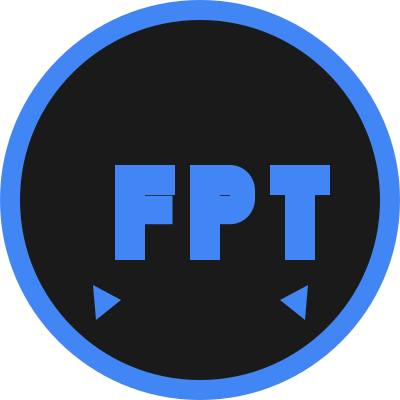

# Gemma Demo

An interactive demonstration of Google's Gemma model using Hugging Face integration.



## Overview

This application provides an interactive interface for exploring the capabilities of Google's Gemma, a lightweight, state-of-the-art open model built from the same research and technology used to create the Gemini models.

The demo showcases various capabilities:
- **Text Generation**: Generate text based on prompts with control over parameters like temperature and max length
- **Question Answering**: Ask questions and get informative responses
- **Code Generation**: Generate code snippets and solutions
- **Creative Writing**: Create stories, poems, and other creative content

## Implementation Options

This repository contains three different implementations of the Gemma demo:

1. **Gradio Implementation** (app_gradio.py) - A user-friendly interface built with Gradio and direct Hugging Face Hub integration.
2. **Streamlit Implementation** (app_streamlit.py) - An alternative interface built with Streamlit.
3. **Flask Implementation** (app.py) - A more traditional web application implementation.

## Requirements

The application requires the following dependencies:
- Python 3.8+
- Hugging Face `transformers` library
- PyTorch
- Gradio or Streamlit (depending on which version you want to run)
- Flask (for the Flask version)

## Setup

1. Clone this repository.
2. Install the required dependencies:
   ```
   pip install -r requirements.txt
   ```
3. Set your Hugging Face API token as an environment variable:
   ```
   export HUGGING_FACE_TOKEN=your_token_here
   ```

## Running the Demo

### Gradio Version
```
python app_gradio.py
```

### Streamlit Version
```
streamlit run app_streamlit.py
```

### Flask Version
```
python app.py
```
or
```
gunicorn wsgi:app
```

## Using the Demo

1. **Select a Model**: Choose between Gemma 2B (smaller, faster) or Gemma 7B (larger, more capable)
2. **Load the Model**: Click the "Load Model" button to load the selected model
3. **Select a Task**: Choose from Text Generation, Question Answering, Code Generation, or Creative Writing
4. **Enter Your Prompt**: Type your prompt or question, or select one of the provided examples
5. **Adjust Parameters**: Modify generation parameters like temperature and max length as needed
6. **Generate**: Click the generation button to create content using the Gemma model

## About Gemma

Gemma is a family of lightweight, state-of-the-art open models from Google, built from the same research and technology used to create the Gemini models. These models excel at a variety of natural language tasks while being efficient enough to run on consumer hardware.

- [Gemma on Hugging Face](https://huggingface.co/google/gemma)
- [Google AI Gemma Overview](https://ai.google.dev/gemma)
- [Gemma on GitHub](https://github.com/google/gemma.cpp)

## License

This demo application is for educational purposes only. Usage of the Gemma model is subject to Google's model license.